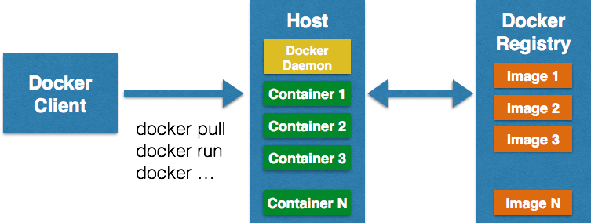
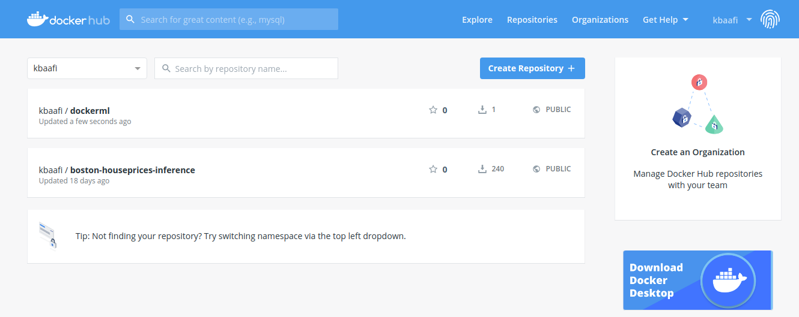
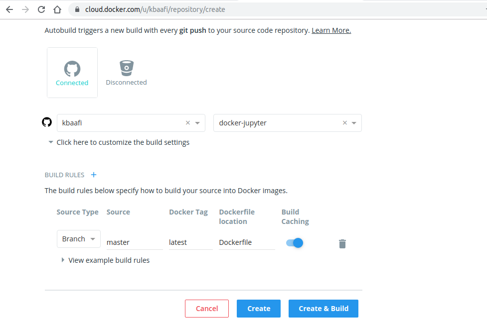
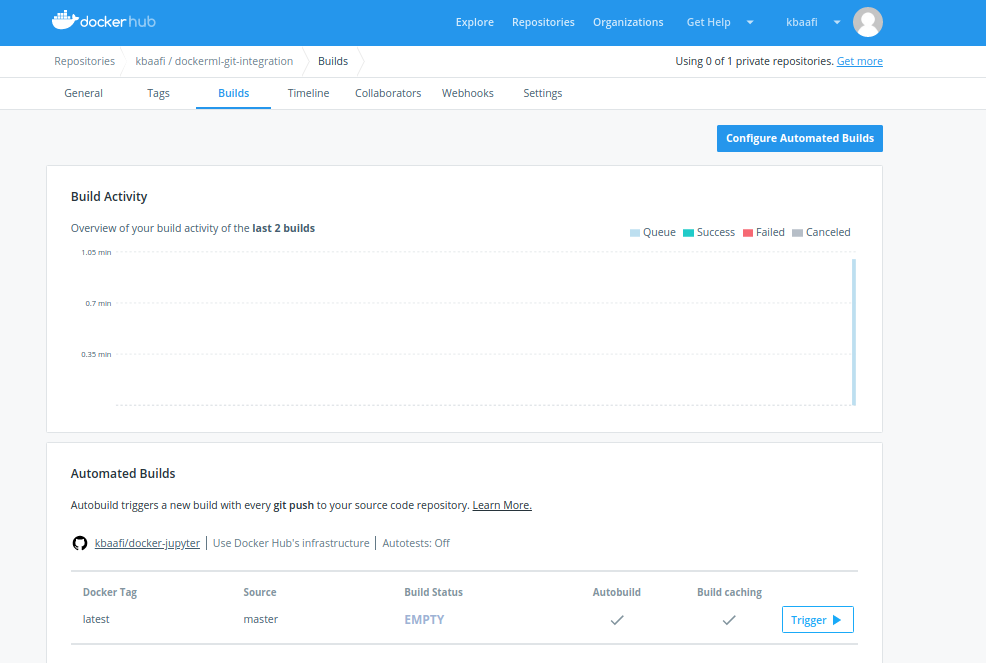
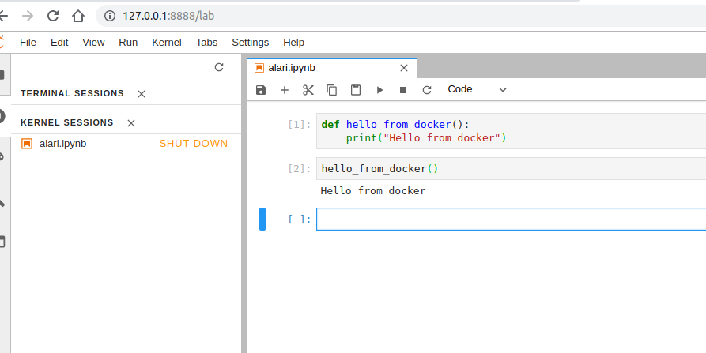

# Using Docker for your machine learning workflow

## What is Docker

Docker is a tool designed to make it easier to create, deploy, and run applications by using containers. Containers allow a developer to package up an application with all of the parts it needs, such as libraries and other dependencies, and ship it all out as one package. By doing so, thanks to the container, the developer can rest assured that the application will run on any other Linux machine regardless of any customized settings that machine might have that could differ from the machine used for writing and testing the code.

## Who is Docker for

Docker is a tool that is designed to benefit both developers and system administrators, making it a part of many DevOps (developers + operations) toolchains. For developers, it means that they can focus on writing code without worrying about the system that it will ultimately be running on. It also allows them to get a head start by using one of thousands of programs already designed to run in a Docker container as a part of their application. For operations staff, Docker gives flexibility and potentially reduces the number of systems needed because of its small footprint and lower overhead.

## Installing Docker CE

### On Debian Linux

* Uninstall old versions

    ```$ sudo apt-get remove docker-engine docker.io```

* Install Docker CE

    ```$ sudo apt-get update```

    ```$ sudo apt-get install docker-ce```

### On Mac

* Download and run this [package file](https://download.docker.com/mac/stable/Docker.dmg)  

### On Windows

The most important fact you need to know is : The current version of Docker for Windows runs on 64bit Windows 10 Pro, Enterprise and Education (1607 Anniversary Update, Build 14393 or later).

If you are running Windows 10 Home, your easiest bet is to run docker in a linux VM, but you can look [here](https://medium.com/@mbyfieldcameron/docker-on-windows-10-home-edition-c186c538dff3)

## Your first container

Let's run a hello-world docker image. Its as simple as

```sudo docker run hello-world```

**But what does it do?**

It runs a preconfigured image called **hello-world** from your docker repositories....yes docker has repositories just like git. In fact you can create, commit and push on docker repositories...we'll talk about that later.

If you dont have a docker repository called **hello-world**, docker will attempt to pull one from dockerhub a container registry.

See below the output from running the command

> kbaafi@kbaafi-pc:~/Desktop/integrify$ sudo docker run hello-world
>    Unable to find image 'hello-world:latest' locally
>    latest: Pulling from library/hello-world
>    1b930d010525: Pull complete 
>    Digest: sha256:6540fc08ee6e6b7b63468dc3317e3303aae178cb8a45ed3123180328bcc1d20f
>    Status: Downloaded newer image for hello-world:latest
> 
> Hello from Docker!
>    This message shows that your installation appears to be working correctly.

## OK now back to Machine Learning how can this Docker thingy help you

Using docker we hope to isolate the dependencies of our machine learning algorithms from a specific host machine such that any other machine, as long as it supports docker can run our algorithms without any dependency issues. Our container should have all that it needs to run the machine learning application or pipeline. We want to be able to install dependencies like pandas, matplotlib, seaborn and others without affecting our host python environment.

## How Docker works

### Images

Images are the basic building blocks of Docker. Containers are built from images and they are self contained virtual environments that run isolated on the host machine, and deliver the application without significant change to the host machine's inner workings.  Images can be configured with applications and used as a template for creating containers. It is organized in a layered fashion. Every change in an image is added as a layer on top of it. Most docker images are derived a base image. An example will be having a base ubuntu image, installing python on it to create a new image and then installing say, pandas on it to create an even newer image.



### Docker/Container registry

A container registry a repository for Docker images. Using Docker registry, you can build and share images with your team. A registry can be public or private. Docker Inc provides a hosted registry service called Docker Hub. It allows you to upload and download images from a central location. 

### Containers

The container is the execution environment for Docker. Containers are created from images. It is a writable layer of the image. You can package your applications in a container, commit it and make it a golden image to build more containers from it. Two or more containers can be linked together to form tiered application architecture. Containers can be started, stopped, committed and terminated. If you terminate a container without committing it, all the changes made to the container will be lost.

## Docker for Data Science: working with a base image

In this tutorial, we aim to build a docker image from a base image that has python 3.7 on a Debian platform.

To do this we can run

```$ sudo docker pull python:3.7.3-stretch```

This will download from dockerhub a debian image with python 3.7.3.

Once this is completed we can verify that we have this image by running

```$ sudo docker image ls```

This produces the following output

> <pre>REPOSITORY          TAG                 IMAGE ID            CREATED             SIZE
>python              3.7.3-stretch       34a518642c76        2 months ago        929MB
>hello-world         latest              fce289e99eb9        7 months ago        1.84kB
></pre>

Now that we have a base python image we can do 2 things:

* login to the container and install the dependencies or

* build a new image using a configuration file called a Dockerfile

### Running the image and installing the dependencies ourselves

To run the container revealing the bash command line,execute the following

```$ sudo docker run -it python:3.7.3-stretch /bin/bash```

Now we can run ```python --version```  in the docker cli to reveal the python version of the container

> root@8d9edb544fbb:/# python --version
>Python 3.7.3

We can also list all containers with the following command:

```$ sudo docker container ls```

Let's examine the output

><pre>CONTAINER ID        IMAGE                  COMMAND             CREATED             STATUS              PORTS               NAMES
>8d9edb544fbb        python:3.7.3-stretch   &quot;/bin/bash&quot;         2 minutes ago       Up 2 minutes                            mystifying_brown
></pre>

#### Installing dependencies

Let's go ahead and install the dependencies by running the following in your container terminal

```console
    $ pip install --upgrade pip
    $ pip install numpy
    $ pip install pandas
    $ pip install scikit-learn
    $ pip install matplotlib
    $ pip install seaborn
    $ pip install jupyterlab
```

Now that we have a good base environment we can save it to our local docker repository and push it to dockerhub (if we have an account...which we should)

We use this command `$ sudo docker commit [container-id] [new_repository:[new_tag]] [-m "message"]`

So we can run

```$ sudo docker commit 8d9edb544fbb dockerml:latest```

We get the output:

> sha256:0e5679ebf0798bb9e54b9d1aca43b856c6d093eaace039d3d736e69fa476f3e2

Now let's verify if our new image exists by running ```$ sudo docker image ls```. This gives us:

> <pre>REPOSITORY          TAG                 IMAGE ID            CREATED             SIZE
>dockerml            latest              0e5679ebf079        3 minutes ago       1.45GB
>python              3.7.3-stretch       34a518642c76        2 months ago        929MB
>hello-world         latest              fce289e99eb9        7 months ago        1.84kB
></pre>

Ok, so now we have our docker image. And its time for me to go to work. I'll push this to dockerhub and continue in my free time:

Lets run docker push to do this:

* `$ sudo docker login --username=kbaafi` to login to docker hub

* ```$ sudo docker tag 0e5679ebf079 kbaafi/dockerml:latest``` to tag the image on dockerhub

* ```$ sudo docker push kbaafi/dockerml``` to push the image to docker hub

We can verify it below:



## Aaand we're back: Pulling your image back from dockerhub

A docker commit away, we built an image and pushed it to dockerhub. Now we're on the office laptop and we want to continue from there. Let's perform a docker pull to download the current version of our machine learning docker image:

```$ sudo docker pull kbaafi/dockerml:latest```

## A better way to build docker images

So far we've seen how to build a docker image, push and pull to a different machine. We've done this manually so far. Let's now see how to build a docker vm from a Dockerfile which has all the configurations needed to run our applications.

1. Create a new folder

2. Create a file called ```Dockerfile``` which we will update with our configurations

3. Create a file called ```requirements.txt```

Now lets go ahead and edit our Dockerfile

Enter the following lines into your Dockerfile

> FROM python:3.7.3-stretch \
\
WORKDIR &nbsp;  /workdir \
\
COPY &nbsp;requirements.txt &nbsp; /workdir/requirements.txt\
\
RUN &nbsp;pip3 &nbsp;install --upgrade&nbsp; pip&nbsp;&& &nbsp;pip &nbsp;install --trusted-host pypi.python.org &nbsp;-r requirements.txt \
\
EXPOSE &nbsp;8888

Now lets explain the contents of this Dockerfile

**FROM python:3.7.3-stretch**: uses the image _python:3.7.3-stretch_ as a base image

**WORKDIR &nbsp; /workdir**: creates a working directory in the root folder of the container

**COPY &nbsp;requirements.txt &nbsp; /workdir/requirements.txt**: copy the requirements.txt (we assume it is in the current folder to the workdir)

**RUN**: upgrades pip and installs the requirements

**EXPOSE &nbsp;8888**: Exposes Jupyter's default network port from the container

See [the Dockerfile](Dockerfile) and [the requirements file](requirements.txt) 

### Building from the docker file

Building from a well formed Dockerfile is quite easy just move to the location of the Dockerfile and run

```$ sudo docker build . -t [repository:tag]```

In our case we can run

```$ sudo docker build . -t dockerml-2:latest```

And we can run ```$ sudo docker image ls``` to confirm and we can now tag and push to DockerHub

**OK, so what is a docker repository?** A Docker image can be compared to a git repo. A git repo can be hosted inside of a GitHub repository, but it could also be hosted on Gitlab, BitBucket or your own git repo hosting service. It could also sit on your development box and not be hosted anywhere.

The same goes for a Docker image. You can choose to not push it anywhere, but you could also push it to the Docker Hub which is both a public and private service for hosting Docker repositories. There are other third party repository hosting services too.

The thing to remember here is a Docker repository is a place for you to publish and access your Docker images. Just like GitHub is a place for you to publish and access your git repos.

It’s also worth pointing out that the Docker Hub and other third party repository hosting services are called “registries”. A registry stores a collection of repositories.

You could say a registry has many repositories and a repository has many different versions of the same image which are individually versioned with tags.

[Reference for explanation on docker registries and repositories](https://nickjanetakis.com/blog/docker-tip-53-difference-between-a-registry-repository-and-image)

## An even better way: Automating your Docker builds by integrating DockerHub with Github

Github+Docker is a match made in heaven that produces wonderful baby deployments. Lets see how this is done.

* Create a github repository with the `Dockerfile` and `requirements.txt`
* Login to your DockerHub account
* Create a new repository on DockerHub
    > Under the **Build Settings** of the **Create Repository** page, select your institution/ account and the repository

* Click **Create & Build**



This automatically begins to build a new docker image for you, with any commit to your Docker repository. Awesome right? 



Now we have a case where not only is our image hosted in the cloud for easy access across all platforms, it is also continuously built after each commit to our git remote repository. Not bad for a beginner in Docker.

Now that our image is being build directly on DockerHub, we can download the latest copy of the image by referring to the dockerhub repository. Let's run

```sudo docker pull kbaafi/dockerml-git-integration:latest```

>   <pre>REPOSITORY                        TAG                 IMAGE ID            CREATED             SIZE
>kbaafi/dockerml-git-integration   latest              214cd1869376        11 minutes ago      1.49GB
>kbaafi/dockerml                   latest              0e5679ebf079        4 hours ago         1.45GB
></pre>  

## Now lets run our ML lab environment

**A few things to know:**

Network communication between the host and the docker container: we have to align ports between host and the docker machine to ensure that networking communications reach the docker machine. Without this you may not be able to access jupyter on the host.

When running the image you can use the following setting

```-p <host_port>:<container_port>``` to connect between the host and the container

Volumes allow the container to persist data on the host and this is where **jupyter+docker** shines when used for machine learning projects. Volumes allow you to connect the working directory on the host to a directory in the container.

You can use the option

```-v host_directory:directory_in_docker``` to setup a volume

### Running the container

```$ sudo docker run -it -p 8888:8888 -v ~/condabooks:/workdir/jupyter kbaafi/dockerml-git-integration /bin/bash```

With this setting, any changes I make in docker when in the folder `/workdir/jupyter` will be reflected on my local folder `~/condabooks`

Now your jupyter machine should be running. Let's start jupyter on the docker machine

```root@0917e6b1a74e:/workdir# cd jupyter```
```root@0917e6b1a74e:/workdir/jupyter# jupyter lab . --ip 0.0.0.0 --allow-root --no-browser```

Docker mostly runs in administrator privileges so the ``--allow-root`` flag must be set!

The following link gives us access to Jupyter on Docker (yours may be different):

`http://127.0.0.1:8888/?token=cf76aa79aebc78b2e719ed575c57afd856ae9cc47b88f2e5`

Jupyter Runs...Yeah!

